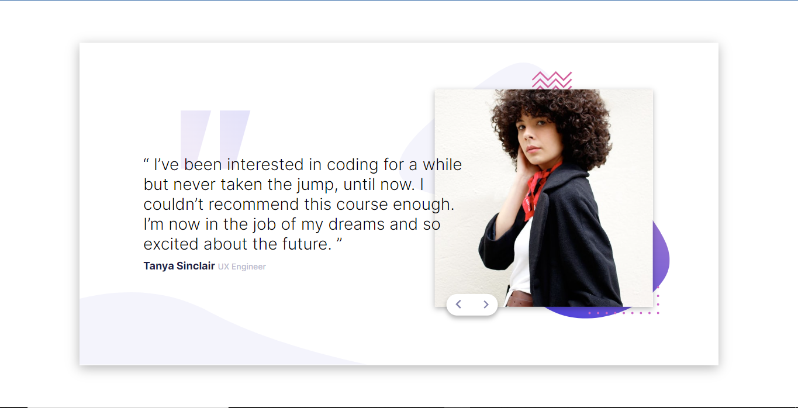
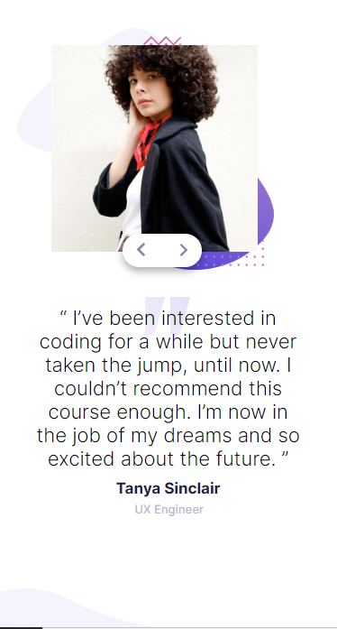

# Frontend Mentor - Coding bootcamp testimonials slider solution

This is a solution to the [Coding bootcamp testimonials slider challenge on Frontend Mentor](https://www.frontendmentor.io/challenges/coding-bootcamp-testimonials-slider-4FNyLA8JL). Frontend Mentor challenges help you improve your coding skills by building realistic projects. 

## Table of contents

- [Overview](#overview)
  - [The challenge](#the-challenge)
  - [Screenshot](#screenshot)
  - [Links](#links)
- [My process](#my-process)
  - [Built with](#built-with)
  - [What I learned](#what-i-learned)
  - [Continued development](#continued-development)
  - [Useful resources](#useful-resources)
- [Author](#author)
- [Acknowledgments](#acknowledgments)

**Note: Delete this note and update the table of contents based on what sections you keep.** 

## Overview

### The challenge

Users should be able to:

- View the optimal layout for the component depending on their device's screen size
- Navigate the slider using either their mouse/trackpad or keyboard

### Screenshot

#### Desktop Screenshot

#### Mobile Screenshoot

### Links

- Solution URL: [Click to see the solution](https://your-solution-url.com)
- Live Site URL: [Click to visit the webpage of the project](https://your-live-site-url.com)

## My process

### Built with

- Semantic HTML5 markup
- CSS custom properties
- Flexbox
- Vanilla JS

### What I learned

Using array to store required information. Also writing functions to access this stored array. And learnt how to use keyboard to carry out an operation on a web page

### Continued development

Need to do more work on JS

### Useful resources

A lot of resources was helpful not just in this project but from the beginning of my learning of web development.
- (https://www.w3schools.com) 

- (https://www.freecodecamp.com)

- (https://www.youtube.com)

- And lots more. Surely, I will always recommend them days in and days out

## Author

- Github - (https://github.com/SAAJEVES)
- Frontend Mentor - (https://www.frontendmentor.io/profile/SAAJEVES)
- Twitter - (https://www.twitter.com/saajeves)
- LinkedIn - (https://www.linkedin.com/in/samuel-ajagun-020283150)

## Acknowledgments

I would love to acknowledge a very good friend of mine (https://github.com/wisdomosara) for his immense contribution on helping me in this project. You are well appreciated.